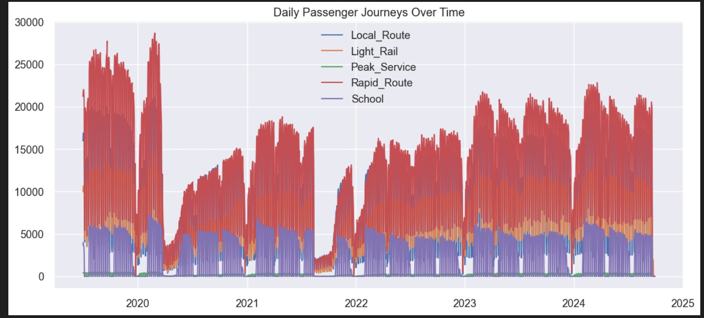

This project analyzes and forecasts public transport ridership across six different service types using advanced time-series forecasting methods such as SARIMAX. The goal is to understand long-term patterns, seasonality, and provide accurate future forecasts for operational planning.

## KEY DATA INSIGHTS

  - NETWORK BACKBONE: The 'Rapid Route' is the dominant carrier.
        - It accounts for 39.1% of all traffic, making it critical for infrastructure investment.
  - WEEKEND EFFICIENCY: Ridership drops significantly on weekends.

    - Rapid Route volume falls by 61.8% on weekends compared to weekdays.
    - Recommendation: Reduce weekend frequency to save operational costs.
    - SCHOOL ALLOCATION: School bus usage is strictly binary.

Total ridership on weekends: 60.
Insight: School assets are 100% idle on weekends and can be repurposed for events or maintenance.
RECOVERY TREND: Strong post-pandemic rebound.

Local Route ridership has grown 37.1% since 2021 averages.
This signals a return to normal commuter patterns.
SERVICE SYNERGY: Rapid Route and Light Rail are tied together.

Correlation Coefficient: 0.9677 (Near perfect).
Insight: When one gets busy, the other does too. They likely feed into each other or serve parallel corridors.

SARIMAX Forecasting Model

Introduction
The SARIMAX model (Seasonal AutoRegressive Integrated Moving Average with Exogenous Variables) is ideal for time-series data containing:
Trend Seasonality Autocorrelation Public transport ridership fits this structure due to weekly and annual recurring patterns.

## COVID-19 Impact (2020–2021) Insight Summary

A sharp, unprecedented drop in ridership during the COVID lockdowns.
This anomaly is consistent across all services.
The steep decline corresponds directly to:
Government restrictions
Reduced travel
Remote education/work
Essential to exclude or adjust for COVID when training stable predictive models.
Rapid Route – Most Stable Service Insight Summary
The Rapid Route exhibits:
The most consistent ridership
Low volatility
Strong weekly rhythm
Its stability makes it the most reliable and predictable service.
Indicates it serves as the backbone of the network and responds well to growth.
Peak Service & School Transport Patterns Insight Summary
Peak Service:
Strong spikes during weekdays
Reflects office/commuter traffic
School Service:
High ridership during school terms
Drops to near-zero in holidays
These patterns require:
Flexible scheduling
Termbased planning
Seasonal adjustments

## SARIMAX Model Structure
SARIMAX(p, d, q) × (P, D, Q, s)

p – Non-seasonal AR order

d – Trend differencing

q – Moving average order

P, D, Q – Seasonal AR, differencing, MA

s – Seasonal period (7 days for weekly pattern)

Evaluation Metrics
SARIMAX performance evaluated using:

MAE – Average error magnitude

RMSE – Penalizes large errors

MAPE – Percentage-based accuracy

Residual diagnostics – Ensured minimal autocorrelation

